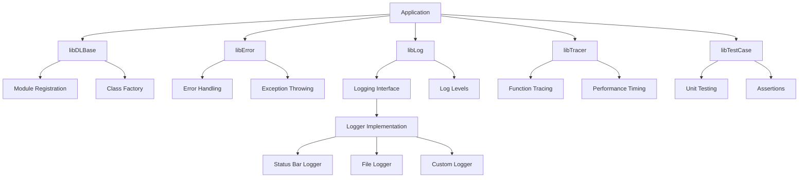
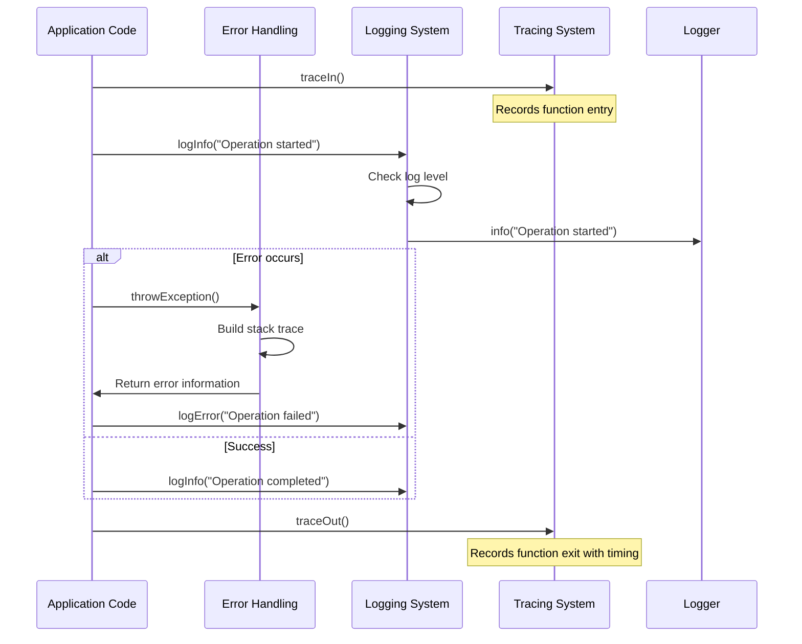

# LotusScript Developer Layer (LSDL) - Architecture Documentation

## Overview

The LotusScript Developer Layer (LSDL) is a framework designed to enhance Lotus Notes/Domino development by providing robust error handling, logging, tracing, and unit testing capabilities in LotusScript. The framework is designed to be easy to use, flexible, and extensible.

## System Architecture

The LSDL framework is structured as a collection of LotusScript libraries that provide various functionalities. The architecture follows a modular approach where each library serves a specific purpose and can be used independently or in combination with other libraries.



## Core Components

### 1. Base Layer (libDLBase)

The base layer provides fundamental functionality for the framework:

- **Module Registration**: Allows libraries, agents, and other design elements to register themselves in the system, enabling proper stack trace display and logging control.
- **Class Factory**: Provides dynamic class instantiation and overloading capabilities.

### 2. Error Handling (libError)

The error handling component provides:

- **Exception Management**: Standardized way to throw and handle exceptions.
- **Stack Trace**: Detailed stack traces with line numbers, module names, and error messages.
- **Custom Error Reporting**: Ability to customize error display formats.

### 3. Logging System (libLog)

The logging system offers:

- **Multiple Log Levels**: ASSERT, ERROR, WARN, INFO, DEBUG, VERBOSE.
- **Configurable Logging**: Control logging verbosity at module, class, or procedure level.
- **Extensible Logger Interface**: Abstract logger interface that can be implemented for different output targets.

### 4. Tracing (libTracer)

The tracing component provides:

- **Function Entry/Exit Tracking**: Automatically track function calls and returns.
- **Performance Measurement**: Timing of function execution.
- **Call Stack Visualization**: Visual representation of the call stack.

### 5. Unit Testing (libTestCase)

The unit testing framework includes:

- **Test Case Definition**: Structure for defining test cases.
- **Assertions**: Various assertion methods for test validation.
- **Test Runner**: Agent for executing tests and reporting results.

## Data Flow



## Extension Points

The LSDL framework is designed to be extensible in several ways:

1. **Custom Loggers**: Implement the Logger class to redirect logs to different targets.
2. **Error Formatting**: Extend ErrorStackReport to customize error display.
3. **Test Assertions**: Add custom assertion methods to the TestCase class.

## Configuration

The framework can be configured through:

- **libConfig.lss**: General configuration settings.
- **libLogConfig.lss**: Logging-specific configuration.

## Usage Patterns

### Error Handling Pattern

```lss
Sub someFunction()
    On Error GoTo catch
    
    ' Function code here
    
    GoTo finally
catch:
    throwException
finally:
End Sub
```

### Tracing Pattern

```lss
Sub someFunction()
    traceIn
    On Error GoTo catch
    
    ' Function code here
    
    GoTo finally
catch:
    traceOut
    throwException
finally:
    traceOut
End Sub
```

### Logging Pattern

```lss
logAssert "Critical assertion message"
logError "Error message"
logWarn "Warning message"
logInfo "Informational message"
logDebug "Debug message"
logVerbose "Verbose message"
```

### Class Inheritance Pattern

```lss
Class MyClass As Throwable
    ' Inherits error handling capabilities
End Class

Class MyLoggableClass As Loggable
    ' Inherits both error handling and logging capabilities
End Class

Class MyTraceableClass As Traceable
    ' Inherits error handling and tracing capabilities
End Class
```

## Deployment Considerations

- The framework is designed to work in both client and server contexts.
- Some components (like StopwatchLSXLC) require specific extensions to be installed.
- Performance impact is minimal for production use when higher log levels are disabled.

## Security Considerations

- Logging sensitive information should be avoided, especially at DEBUG and VERBOSE levels.
- Error messages displayed to end users should be sanitized to avoid exposing implementation details.

## Future Enhancements

Potential areas for enhancement include:

1. Dynamic switching of Loggers from the UI without code modification.
2. Support for structured logging formats compatible with log analyzers.
3. Integration with external monitoring systems.
4. Enhanced performance metrics and reporting.