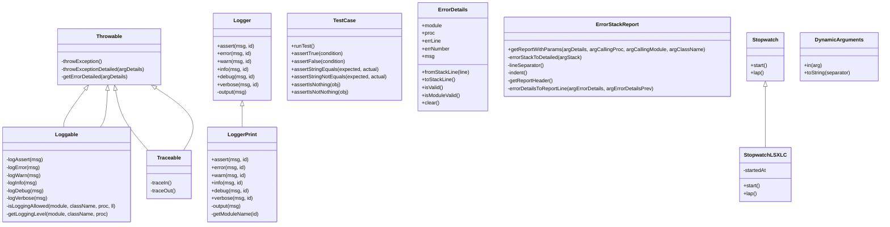
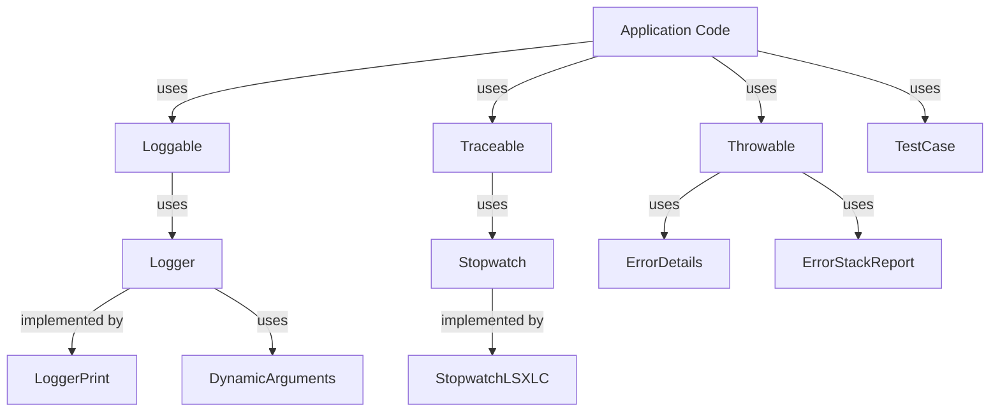

# LotusScript Developer Layer (LSDL) - Class Structure Documentation

## Overview

This document describes the class structure of the LotusScript Developer Layer (LSDL) framework, detailing the key classes, their relationships, inheritance hierarchies, and responsibilities.

## Class Hierarchy

The LSDL framework uses inheritance to provide layered functionality to application code. The following diagram illustrates the main class hierarchy:



## Key Classes and Their Responsibilities

### Base Classes

#### Throwable
- **Purpose**: Provides error handling capabilities
- **Key Methods**:
  - `throwException()`: Throws an exception with stack trace
  - `throwExceptionDetailed(argDetails)`: Throws an exception with additional details
  - `getErrorDetailed(argDetails)`: Gets formatted error information

#### Loggable
- **Purpose**: Provides logging capabilities
- **Inherits From**: Throwable
- **Key Methods**:
  - `logAssert/logError/logWarn/logInfo/logDebug/logVerbose`: Log at different levels
  - `isLoggingAllowed`: Checks if logging is enabled for a specific level
  - `getLoggingLevel`: Gets the configured log level

#### Traceable
- **Purpose**: Provides function tracing capabilities
- **Inherits From**: Throwable
- **Key Methods**:
  - `traceIn()`: Marks function entry
  - `traceOut()`: Marks function exit

### Logging Classes

#### Logger
- **Purpose**: Abstract base class for logger implementations
- **Key Methods**:
  - `assert/error/warn/info/debug/verbose`: Methods for different log levels
  - `output`: Abstract method for actual log output

#### LoggerPrint
- **Purpose**: Concrete logger implementation that outputs to status bar
- **Inherits From**: Logger
- **Key Methods**:
  - Implementations of all log level methods
  - `output`: Outputs to status bar/console
  - `getModuleName`: Formats module name for output

### Error Handling Classes

#### ErrorDetails
- **Purpose**: Stores information about an error
- **Key Properties**:
  - `module`: Module where error occurred
  - `proc`: Procedure where error occurred
  - `errLine`: Line number
  - `errNumber`: Error code
  - `msg`: Error message
- **Key Methods**:
  - `fromStackLine`: Parses error information from stack trace
  - `toStackLine`: Formats error information for stack trace
  - `isValid`: Checks if error details are valid

#### ErrorStackReport
- **Purpose**: Formats error stack traces for display
- **Key Methods**:
  - `getReportWithParams`: Generates a formatted error report
  - `errorStackToDetailed`: Converts raw stack to readable format
  - `errorDetailsToReportLine`: Formats a single error line

### Testing Classes

#### TestCase
- **Purpose**: Base class for unit tests
- **Key Methods**:
  - `runTest()`: Abstract method to run tests
  - `assert*` methods: Various assertion methods for testing

### Utility Classes

#### Stopwatch
- **Purpose**: Interface for timing operations
- **Key Methods**:
  - `start()`: Starts timing
  - `lap()`: Returns elapsed time

#### StopwatchLSXLC
- **Purpose**: Implementation of Stopwatch using LSXLC
- **Inherits From**: Stopwatch
- **Key Properties**:
  - `startedAt`: Start time
- **Key Methods**:
  - `start()`: Starts timing
  - `lap()`: Returns elapsed time

#### DynamicArguments
- **Purpose**: Provides a fluent interface for building argument chains
- **Key Methods**:
  - `in(arg)`: Adds an argument to the chain
  - `toString(separator)`: Converts arguments to string

## Class Relationships

### Inheritance Relationships

1. **Error Handling Hierarchy**:
   - `Throwable` is the base class for error handling
   - `Loggable` and `Traceable` extend `Throwable` to add functionality

2. **Logger Hierarchy**:
   - `Logger` is the abstract base class
   - `LoggerPrint` is a concrete implementation

3. **Stopwatch Hierarchy**:
   - `Stopwatch` is the interface
   - `StopwatchLSXLC` is an implementation

### Composition Relationships



## Class Usage Patterns

### Error Handling Pattern

```lss
Class MyClass As Throwable
    Sub someMethod()
        On Error GoTo catch
        
        ' Method code
        
        GoTo finally
    catch:
        throwException
    finally:
    End Sub
End Class
```

### Logging Pattern

```lss
Class MyClass As Loggable
    Sub someMethod()
        logInfo "Starting method"
        
        ' Method code
        
        logDebug "Method completed"
    End Sub
End Class
```

### Tracing Pattern

```lss
Class MyClass As Traceable
    Sub someMethod()
        traceIn
        On Error GoTo catch
        
        ' Method code
        
        GoTo finally
    catch:
        traceOut
        throwException
    finally:
        traceOut
    End Sub
End Class
```

### Testing Pattern

```lss
Class MyLibraryTest As TestCase
    Private Function runTest() As Variant
        Call testFeature1()
        Call testFeature2()
    End Function
    
    Private Sub testFeature1()
        Call assertTrue(SomeFunction())
        Call assertStringEquals("Expected", SomeOtherFunction())
    End Sub
    
    Private Sub testFeature2()
        Call assertIsNotNothing(CreateObject())
    End Sub
End Class
```

## Extension Points

The LSDL framework is designed to be extensible through several mechanisms:

### 1. Custom Logger Implementation

```lss
Class MyCustomLogger As Logger
    Sub assert(msg As String, id As DynamicArguments)
        ' Custom implementation
    End Sub
    
    ' Implement other methods...
    
    Private Sub Output(msg As String)
        ' Custom output logic
    End Sub
End Class
```

### 2. Custom Error Reporting

```lss
Class MyCustomErrorReport As ErrorStackReport
    Private Function getReportHeader()
        getReportHeader = "Custom Error Report:"
    End Function
    
    ' Override other methods as needed
End Class
```

### 3. Custom Stopwatch

```lss
Class MyCustomStopwatch As Stopwatch
    ' Custom timing implementation
    
    Sub start()
        ' Custom start logic
    End Sub
    
    Function lap() As Long
        ' Custom lap logic
    End Function
End Class
```

## Best Practices

1. **Inheritance Strategy**: Choose the appropriate base class based on the functionality needed:
   - Use `Throwable` for basic error handling
   - Use `Loggable` for error handling + logging
   - Use `Traceable` for error handling + tracing

2. **Logger Selection**: Configure the appropriate logger implementation based on the environment:
   - Use `LoggerPrint` for development
   - Use a file-based logger for production
   - Use a custom logger for specific requirements

3. **Error Detail Level**: Provide appropriate error details based on the context:
   - Use `throwException()` for standard errors
   - Use `throwExceptionDetailed()` for errors that need additional context

4. **Test Organization**: Structure test classes to mirror the libraries they test:
   - One test class per library
   - Test methods named after the functions they test

## Implementation Notes

1. **Thread Safety**: The framework uses thread-specific information to track module names and trace stacks.

2. **Dynamic Loading**: The framework uses dynamic loading to support extension and configuration.

3. **Error Handling**: The framework uses On Error GoTo for error handling, which is the standard pattern in LotusScript.

4. **Performance Considerations**: Logging and tracing can be disabled in production to minimize performance impact.