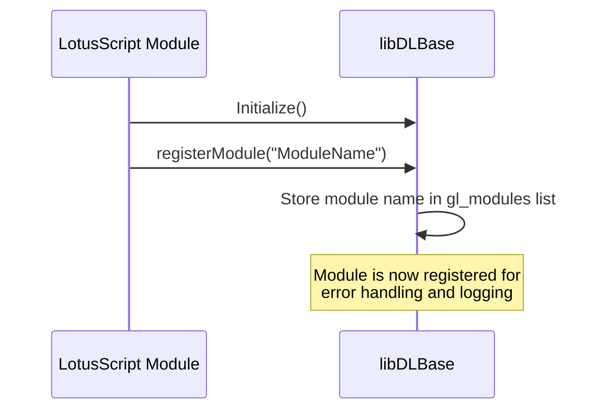
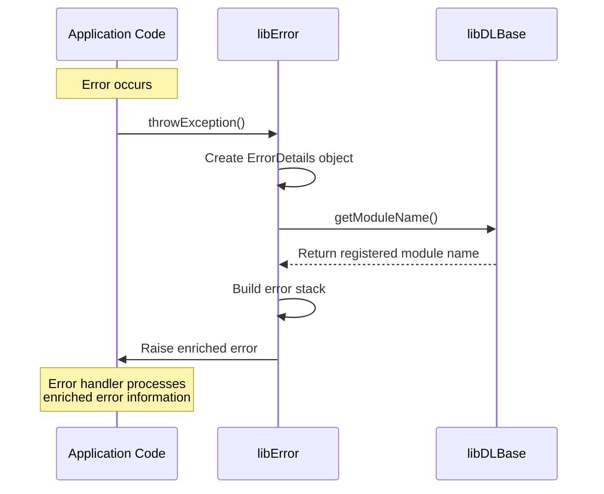
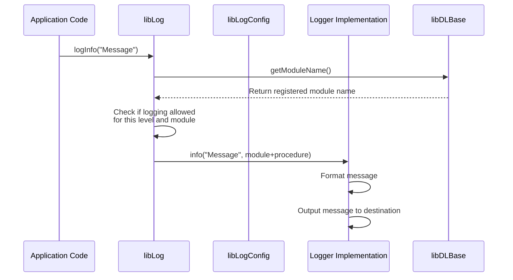
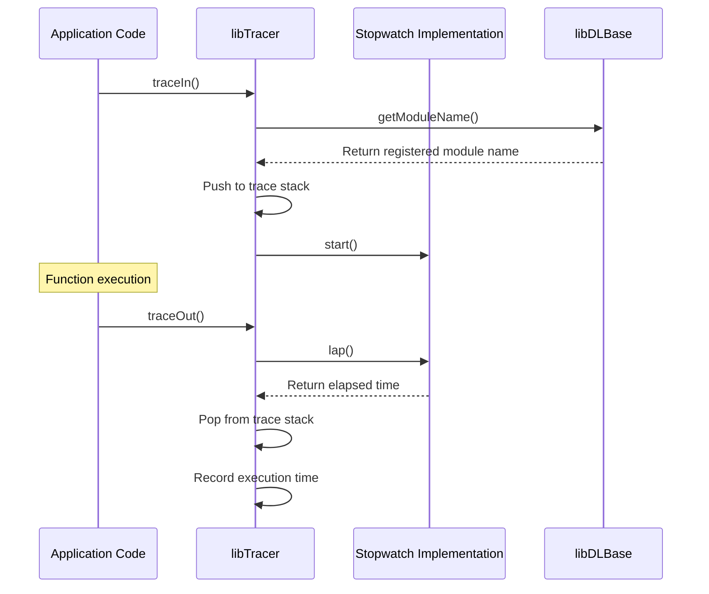
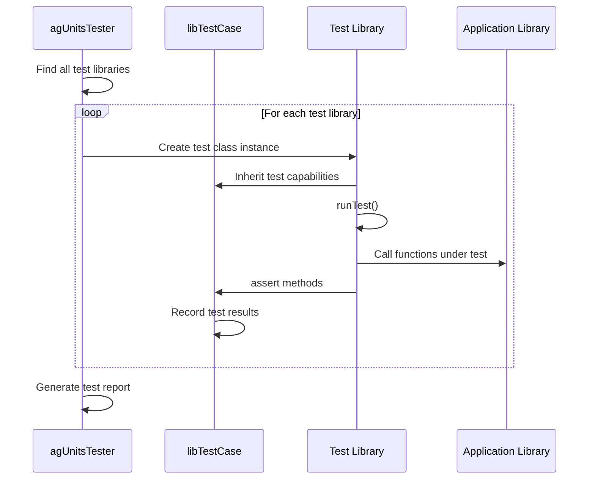
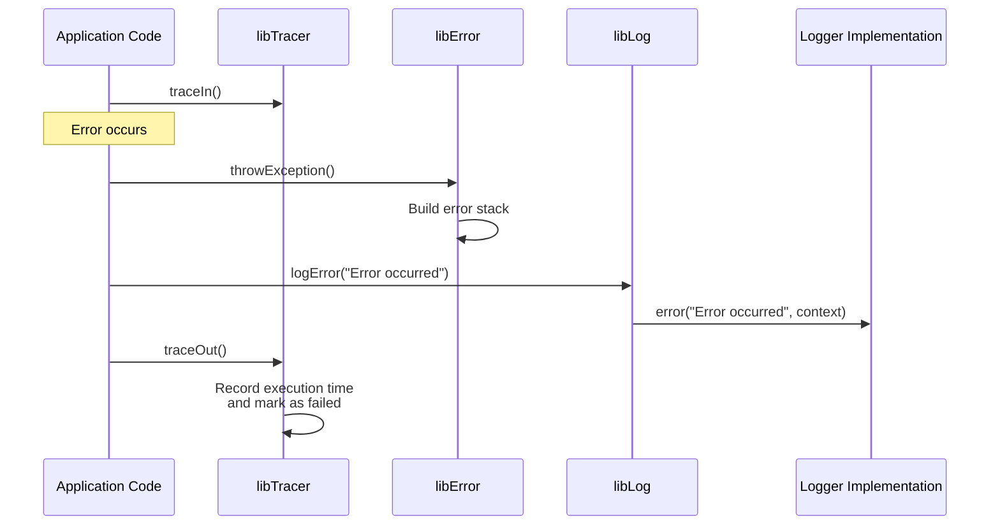
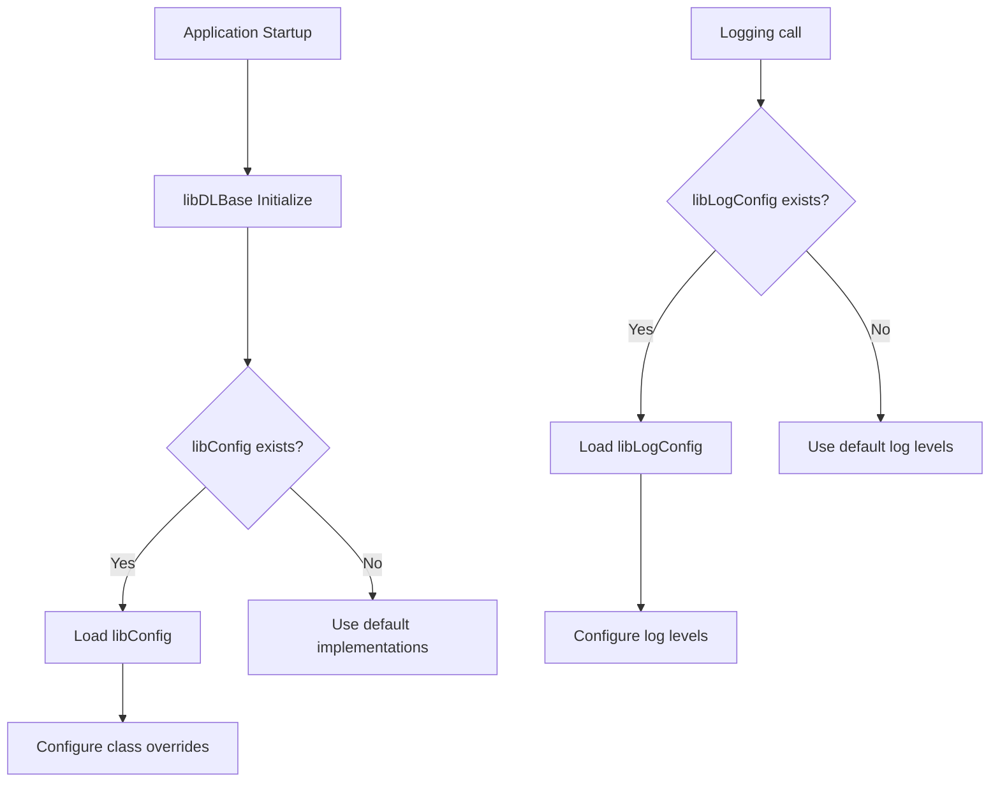

# LotusScript Developer Layer (LSDL) - Data Flow Documentation

## Overview

This document describes the data flow within the LotusScript Developer Layer (LSDL) framework, illustrating how information moves between different components during various operations such as error handling, logging, tracing, and unit testing.

## Core Data Flows

### Module Registration Flow

When a LotusScript module (library, agent, form, etc.) initializes, it registers itself with the framework to enable proper identification in logs, traces, and error reports.



### Error Handling Flow

When an error occurs in application code, the error handling flow captures, enriches, and reports the error information.



### Logging Flow

The logging system processes log messages according to configured log levels and routes them to the appropriate output destination.



### Tracing Flow

The tracing system tracks function entry and exit, measuring execution time and building a call stack.



### Unit Testing Flow

The unit testing framework executes test cases and collects results for reporting.



## Cross-Component Data Flow

### Error Handling with Logging and Tracing

When an error occurs in a traced function, the interaction between error handling, logging, and tracing components is as follows:



## Data Structures

### Module Registration Data

The module registration system maintains a list of module names indexed by their thread identifiers:

```
gl_modules List As String
- Key: GetThreadInfo(11) [Thread identifier]
- Value: Module name
```

### Logging Level Configuration

Logging levels are stored in a hierarchical structure that allows for granular control:

```
gl_loggingLevel List As Byte
- Key: "module|class|procedure" or "module|class" or "module" or "ALL"
- Value: Log level (LL_NONE, LL_ASSERT, LL_ERROR, LL_WARN, LL_INFO, LL_DEBUG, LL_VERBOSE, LL_ALL)
```

### Error Stack Data

Error information is structured as follows:

```
ErrorDetails Class
- module: String - Module name
- proc: String - Procedure name
- errLine: String - Line number where error occurred
- errNumber: String - Error code
- msg: String - Error message
```

### Trace Stack Data

The tracing system maintains a stack of function calls:

```
gl_traceStack List As TraceStackItem
- Key: Integer index
- Value: TraceStackItem object containing:
  - module: String - Module name
  - proc: String - Procedure name
  - startTime: Long - Start timestamp
```

## Configuration Flow

The configuration of the LSDL framework is handled through specialized libraries:



## Extension Points

The framework provides several extension points where data can be intercepted and processed:

1. **Custom Logger Implementation**: By implementing the Logger class, you can redirect log output to different destinations.

2. **Custom Error Reporting**: By extending ErrorStackReport, you can customize how error information is formatted and displayed.

3. **Custom Stopwatch**: By implementing the Stopwatch interface, you can provide alternative timing mechanisms.

## Performance Considerations

- **Logging Impact**: Higher log levels (DEBUG, VERBOSE) generate more data and can impact performance.
- **Tracing Overhead**: Function tracing adds a small overhead to each function call.
- **Error Stack Building**: Building detailed error stacks has a cost when errors occur.

## Security Considerations

- **Sensitive Data**: Be cautious about logging sensitive information.
- **Error Messages**: Consider what information is exposed in error messages.

## Best Practices

1. **Selective Logging**: Configure appropriate log levels for different modules.
2. **Strategic Tracing**: Apply tracing selectively to avoid performance impact.
3. **Meaningful Error Messages**: Provide context in error messages to aid troubleshooting.
4. **Regular Testing**: Use the unit testing framework to ensure code quality.