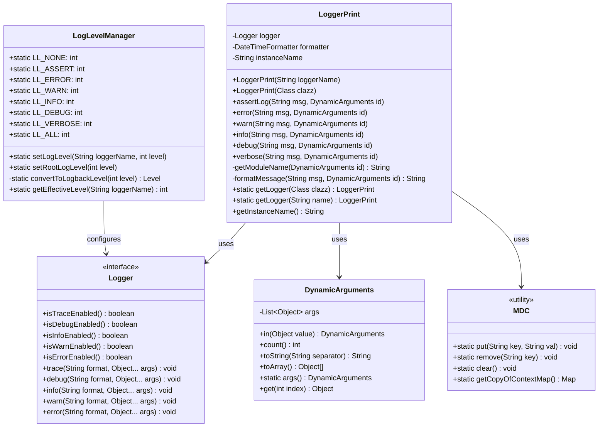
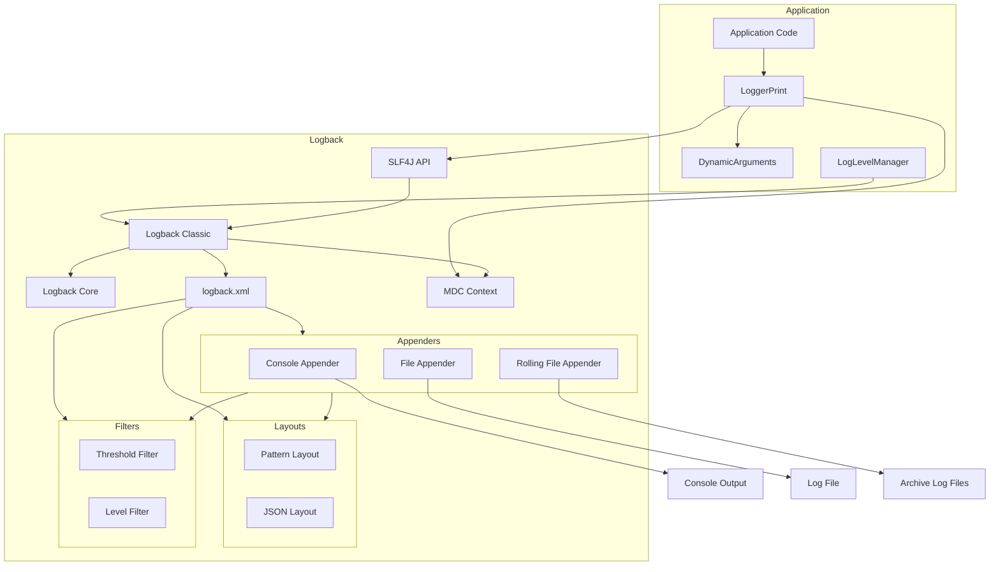
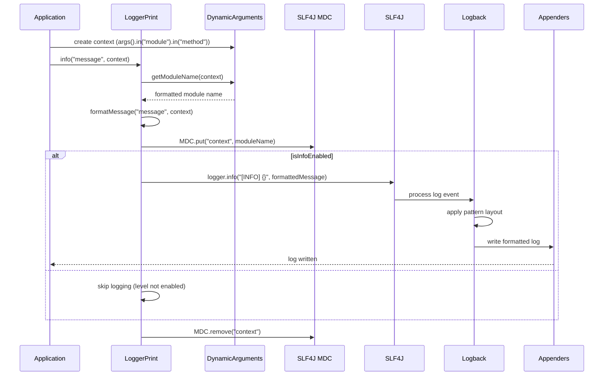
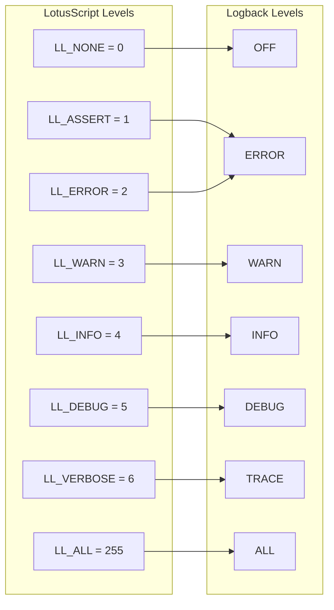
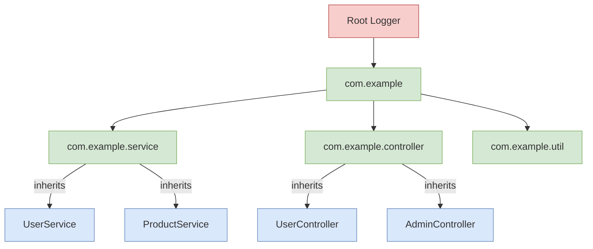
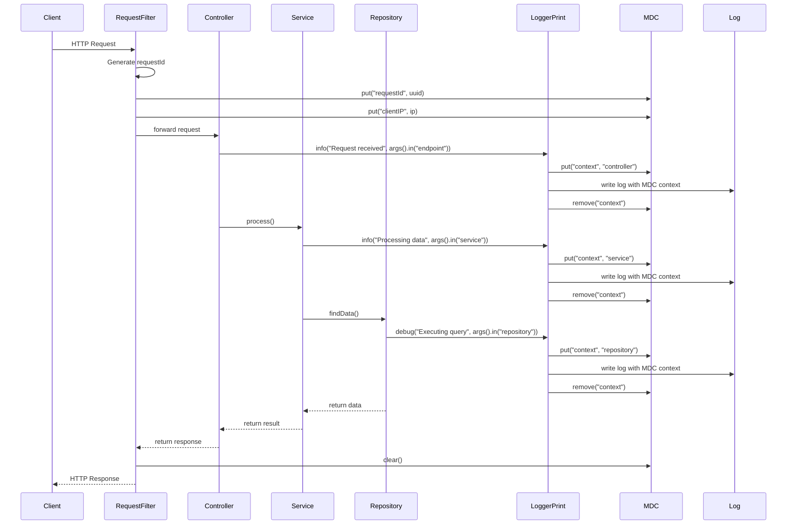

# LoggerPrint Logback Architecture

This document provides architectural diagrams for the Java implementation of the LoggerPrint class using Logback.

## Class Diagram



## Component Diagram



## Sequence Diagram for Logging Process



## Log Level Mapping



## Spring Integration

```mermaid
flowchart TB
    subgraph "Spring Application"
        Config[LoggingConfig]
        Service1[UserService]
        Service2[ProductService]
        Controller[WebController]
        Repository[DataRepository]
        Interceptor[LoggingInterceptor]
        Aspect[LoggingAspect]
    end
    
    subgraph "Logging Components"
        LP1[LoggerPrint Bean: applicationLogger]
        LP2[LoggerPrint Bean: userServiceLogger]
        LP3[LoggerPrint Bean: productServiceLogger]
        LP4[LoggerPrint Bean: dataLogger]
    end
    
    subgraph "Spring Context"
        PropSource[PropertySource]
        Profiles[Spring Profiles]
    end
    
    Config -->|@Bean| LP1
    Config -->|@Bean| LP2
    Config -->|@Bean| LP3
    Config -->|@Bean| LP4
    
    Service1 -->|@Autowired| LP2
    Service2 -->|@Autowired| LP3
    Controller -->|@Autowired| LP1
    Repository -->|@Autowired| LP4
    
    Interceptor -->|uses| LP1
    Aspect -->|uses| LP1
    
    PropSource -->|configure| Config
    Profiles -->|activate| Config
```

## Logback Configuration Hierarchy



## MDC Context Flow

