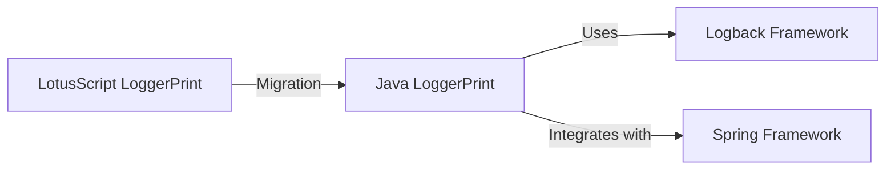

# LoggerPrint Migration Documentation

This folder contains comprehensive documentation for migrating the `LoggerPrint` class from LotusScript to Java using the Logback logging framework.

## Document Index

1. [**LoggerPrint Java Migration Specification**](./LoggerPrint_Java_Logback_Migration_Spec.md)
   - Complete technical specification for implementing the Java version of LoggerPrint
   - Includes class structures, method definitions, and configuration details
   - Provides a step-by-step guide for junior Java developers

2. [**LoggerPrint Logback Architecture**](./LoggerPrint_Logback_Architecture.md)
   - Visual diagrams of the architecture using Mermaid
   - Class diagrams showing relationships between components
   - Sequence diagrams illustrating the logging process
   - Component diagrams showing integration with Logback

3. [**LoggerPrint Migration Comparison**](./LoggerPrint_Migration_Comparison.md)
   - Side-by-side comparison of LotusScript and Java implementations
   - Highlights key differences and improvements
   - Maps LotusScript concepts to Java/Logback equivalents

4. [**LoggerPrint Java Usage Examples**](./LoggerPrint_Java_Usage_Examples.md)
   - Practical code examples for common logging scenarios
   - Spring Framework integration examples
   - Advanced usage patterns and performance optimization techniques
   - Testing examples

## Migration Overview

The migration of `LoggerPrint` from LotusScript to Java involves:

1. **Replacing the direct `Print` statement** with configurable Logback appenders
2. **Maintaining the same logging levels** (mapped to SLF4J/Logback levels)
3. **Preserving the context information** using `DynamicArguments` and SLF4J MDC
4. **Adding Spring Framework integration** for dependency injection
5. **Enhancing configurability** through Logback's XML configuration

## Key Benefits of Migration

1. **Improved Thread Safety**: The Java implementation is fully thread-safe
2. **Enhanced Configurability**: Flexible configuration through XML files
3. **Better Performance**: Optimized logging with conditional checks and async appenders
4. **Integration Capabilities**: Works with Spring and other Java frameworks
5. **Advanced Features**: MDC context, pattern layouts, and filtering
6. **Maintainability**: Standard Java logging practices and patterns

## Getting Started

Junior Java developers should start by reading the [LoggerPrint Java Migration Specification](./LoggerPrint_Java_Logback_Migration_Spec.md) document, which provides a comprehensive guide to implementing the Java version of LoggerPrint.

For practical examples, refer to the [LoggerPrint Java Usage Examples](./LoggerPrint_Java_Usage_Examples.md) document, which demonstrates how to use the logger in various scenarios.

## Additional Resources

- [Logback Documentation](https://logback.qos.ch/documentation.html)
- [SLF4J User Manual](https://www.slf4j.org/manual.html)
- [Spring Boot Logging](https://docs.spring.io/spring-boot/docs/current/reference/html/features.html#features.logging)