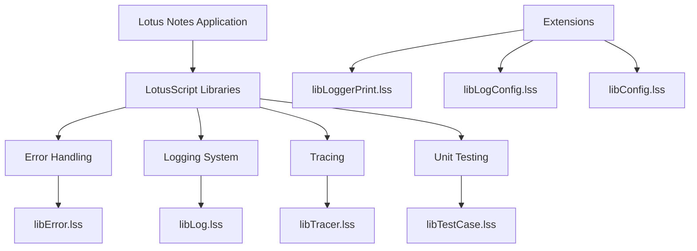
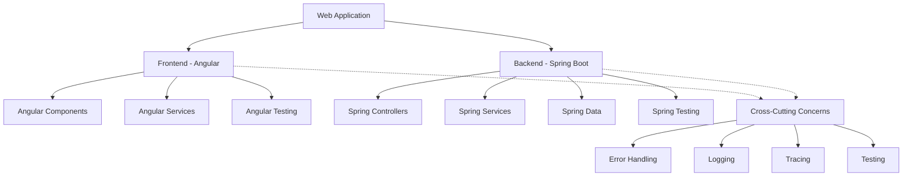
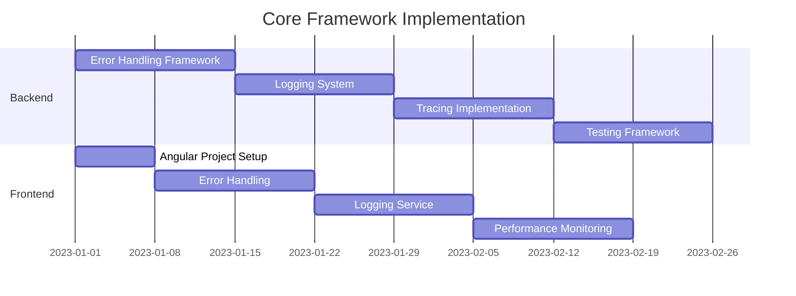
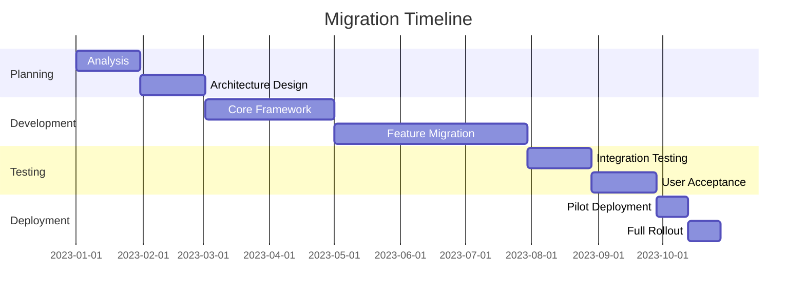

# Migration Strategy: LSDL to Angular and Java Spring

## Overview

This document outlines the strategy for migrating the LotusScript Developer Layer (LSDL) framework from Lotus Notes/Domino to a modern architecture using Angular for the frontend and Java Spring for the backend. The migration will preserve the core functionality while leveraging modern development practices and technologies.

## Current Architecture

The current LSDL framework is implemented in LotusScript and consists of several key components:

1. **Error Handling**: Standardized exception handling and stack trace reporting
2. **Logging System**: Configurable logging with multiple levels
3. **Tracing**: Function entry/exit tracking with performance measurement
4. **Unit Testing**: Framework for defining and running tests



## Target Architecture

The target architecture will use Angular for the frontend and Java Spring for the backend, with equivalent functionality implemented in these modern frameworks.



## Functional Mapping

### Error Handling

| LSDL Component | Angular/Spring Equivalent |
|----------------|---------------------------|
| `Throwable` class | Custom exception classes in Java |
| `throwException()` | `throw new CustomException()` |
| `getErrorDetailed()` | Exception with detailed message |
| Error stack reporting | Spring `@ControllerAdvice` for global error handling |
| | Angular error interceptors |

### Logging System

| LSDL Component | Angular/Spring Equivalent |
|----------------|---------------------------|
| `Logger` class | SLF4J/Logback in Spring |
| | Angular logging service |
| Log levels | SLF4J log levels |
| `logInfo()`, etc. | `logger.info()`, etc. |
| Logger configuration | `application.properties` or `logback.xml` |
| | Angular environment configuration |

### Tracing

| LSDL Component | Angular/Spring Equivalent |
|----------------|---------------------------|
| `Traceable` class | Spring AOP for method tracing |
| | Angular interceptors |
| `traceIn()`/`traceOut()` | `@Around` aspect in Spring |
| Performance timing | Spring Actuator metrics |
| | Angular performance API |

### Unit Testing

| LSDL Component | Angular/Spring Equivalent |
|----------------|---------------------------|
| `TestCase` class | JUnit in Spring |
| | Jasmine/Karma in Angular |
| `assert*` methods | JUnit assertions |
| | Jasmine expectations |
| Test runner | Maven/Gradle test runners |
| | Angular test bed |

## Migration Approach

The migration will follow these phases:

### Phase 1: Analysis and Planning

1. **Detailed Code Analysis**
   - Document all current functionality
   - Identify usage patterns
   - Map dependencies

2. **Architecture Design**
   - Design the target architecture
   - Define component boundaries
   - Plan API interfaces

3. **Technology Selection**
   - Select specific frameworks and libraries
   - Define coding standards
   - Set up development environment

### Phase 2: Core Framework Implementation



1. **Backend Core**
   - Implement exception handling framework
   - Set up logging infrastructure
   - Create method tracing aspects
   - Establish testing framework

2. **Frontend Core**
   - Set up Angular project structure
   - Implement error handling interceptors
   - Create logging service
   - Develop performance monitoring

### Phase 3: Feature Migration

1. **Incremental Migration**
   - Migrate features one by one
   - Maintain parallel systems during transition
   - Validate each migrated feature

2. **Integration Testing**
   - Test frontend-backend integration
   - Verify functionality matches original
   - Performance testing

### Phase 4: Deployment and Transition

1. **User Training**
   - Train users on new system
   - Document new procedures
   - Provide support during transition

2. **Phased Rollout**
   - Deploy to pilot group
   - Address feedback
   - Full deployment

## Technical Implementation Details

### Backend (Spring Boot)

#### Error Handling

```java
@ControllerAdvice
public class GlobalExceptionHandler {
    
    private static final Logger logger = LoggerFactory.getLogger(GlobalExceptionHandler.class);
    
    @ExceptionHandler(CustomException.class)
    public ResponseEntity<ErrorResponse> handleCustomException(CustomException ex, WebRequest request) {
        logger.error("Error occurred: {}", ex.getMessage(), ex);
        
        ErrorResponse errorResponse = new ErrorResponse(
            HttpStatus.INTERNAL_SERVER_ERROR.value(),
            ex.getMessage(),
            ex.getStackTrace()
        );
        
        return new ResponseEntity<>(errorResponse, HttpStatus.INTERNAL_SERVER_ERROR);
    }
}
```

#### Logging

```java
@Service
public class UserService {
    
    private static final Logger logger = LoggerFactory.getLogger(UserService.class);
    
    public User findById(Long id) {
        logger.info("Finding user with ID: {}", id);
        
        try {
            // Business logic
            return userRepository.findById(id)
                .orElseThrow(() -> new NotFoundException("User not found"));
        } catch (Exception e) {
            logger.error("Error finding user: {}", e.getMessage(), e);
            throw e;
        }
    }
}
```

#### Tracing

```java
@Aspect
@Component
public class MethodTracingAspect {
    
    private static final Logger logger = LoggerFactory.getLogger(MethodTracingAspect.class);
    
    @Around("execution(* com.example.service.*.*(..))")
    public Object traceMethod(ProceedingJoinPoint joinPoint) throws Throwable {
        String methodName = joinPoint.getSignature().getName();
        String className = joinPoint.getTarget().getClass().getSimpleName();
        
        logger.debug("Entering: {}.{}", className, methodName);
        long startTime = System.currentTimeMillis();
        
        try {
            Object result = joinPoint.proceed();
            long endTime = System.currentTimeMillis();
            logger.debug("Exiting: {}.{}, execution time: {} ms", 
                className, methodName, (endTime - startTime));
            return result;
        } catch (Throwable t) {
            logger.error("Exception in {}.{}: {}", className, methodName, t.getMessage());
            throw t;
        }
    }
}
```

### Frontend (Angular)

#### Error Handling

```typescript
@Injectable()
export class ErrorInterceptor implements HttpInterceptor {
  
  constructor(private errorService: ErrorService) {}
  
  intercept(request: HttpRequest<any>, next: HttpHandler): Observable<HttpEvent<any>> {
    return next.handle(request).pipe(
      catchError(error => {
        if (error instanceof HttpErrorResponse) {
          const errorMessage = error.error?.message || 'Unknown error occurred';
          this.errorService.handleError(errorMessage);
        }
        return throwError(() => error);
      })
    );
  }
}
```

#### Logging Service

```typescript
@Injectable({
  providedIn: 'root'
})
export class LoggingService {
  
  logLevel = LogLevel.INFO;
  
  constructor() {}
  
  error(message: string, ...data: any[]): void {
    this.logWithLevel(LogLevel.ERROR, message, data);
  }
  
  warn(message: string, ...data: any[]): void {
    this.logWithLevel(LogLevel.WARN, message, data);
  }
  
  info(message: string, ...data: any[]): void {
    this.logWithLevel(LogLevel.INFO, message, data);
  }
  
  debug(message: string, ...data: any[]): void {
    this.logWithLevel(LogLevel.DEBUG, message, data);
  }
  
  private logWithLevel(level: LogLevel, message: string, data: any[]): void {
    if (level <= this.logLevel) {
      const timestamp = new Date().toISOString();
      const logMessage = `${timestamp} [${LogLevel[level]}] ${message}`;
      
      switch (level) {
        case LogLevel.ERROR:
          console.error(logMessage, ...data);
          break;
        case LogLevel.WARN:
          console.warn(logMessage, ...data);
          break;
        case LogLevel.INFO:
          console.info(logMessage, ...data);
          break;
        case LogLevel.DEBUG:
          console.debug(logMessage, ...data);
          break;
      }
    }
  }
}

enum LogLevel {
  ERROR = 0,
  WARN = 1,
  INFO = 2,
  DEBUG = 3
}
```

## Testing Strategy

### Backend Testing

1. **Unit Testing**
   - JUnit for individual components
   - Mockito for mocking dependencies

2. **Integration Testing**
   - Spring Boot Test for API endpoints
   - TestContainers for database testing

3. **Performance Testing**
   - JMeter for load testing
   - Spring Boot Actuator for metrics

### Frontend Testing

1. **Unit Testing**
   - Jasmine for component and service testing
   - Karma as the test runner

2. **End-to-End Testing**
   - Protractor or Cypress for E2E tests
   - Selenium for browser automation

## Data Migration

1. **Data Analysis**
   - Identify data structures
   - Map to new database schema

2. **Migration Scripts**
   - Develop scripts to extract data
   - Transform to new format
   - Load into new database

3. **Validation**
   - Verify data integrity
   - Reconcile data counts
   - Test data access patterns

## Risks and Mitigation

| Risk | Impact | Mitigation |
|------|--------|------------|
| Functionality gaps | High | Thorough analysis, feature parity validation |
| Performance issues | Medium | Early performance testing, optimization |
| User adoption | High | Training, documentation, support |
| Data migration errors | High | Validation scripts, rollback plan |
| Integration challenges | Medium | Incremental approach, thorough testing |

## Timeline and Milestones



## Success Criteria

1. **Functional Equivalence**
   - All existing functionality is available in the new system
   - No regression in capabilities

2. **Performance**
   - Equal or better performance than the original system
   - Scalability for future growth

3. **User Satisfaction**
   - Positive feedback from users
   - Smooth transition with minimal disruption

4. **Maintainability**
   - Clean, well-documented code
   - Comprehensive test coverage
   - Modern development practices

## Conclusion

The migration from the LSDL framework in Lotus Notes to a modern Angular and Spring Boot architecture represents a significant modernization effort. By following this structured approach, the migration can be accomplished while preserving the valuable functionality of the original system and adding the benefits of modern development practices and technologies.

The new system will be more maintainable, scalable, and aligned with current industry standards, providing a solid foundation for future enhancements and integrations.