# LotusScript Developer Layer (LSDL) - Sequence Diagrams

## Overview

This document provides sequence diagrams for key operations in the LotusScript Developer Layer (LSDL) framework, illustrating how different components interact during various processes.

## Module Registration Sequence

When a LotusScript module initializes, it registers itself with the framework to enable proper identification in logs, traces, and error reports.

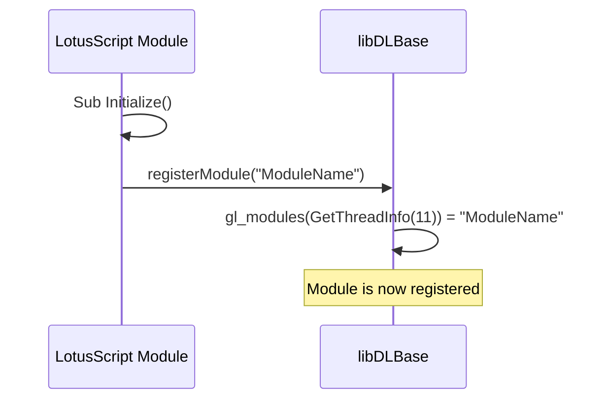

## Error Handling Sequence

### Basic Error Handling

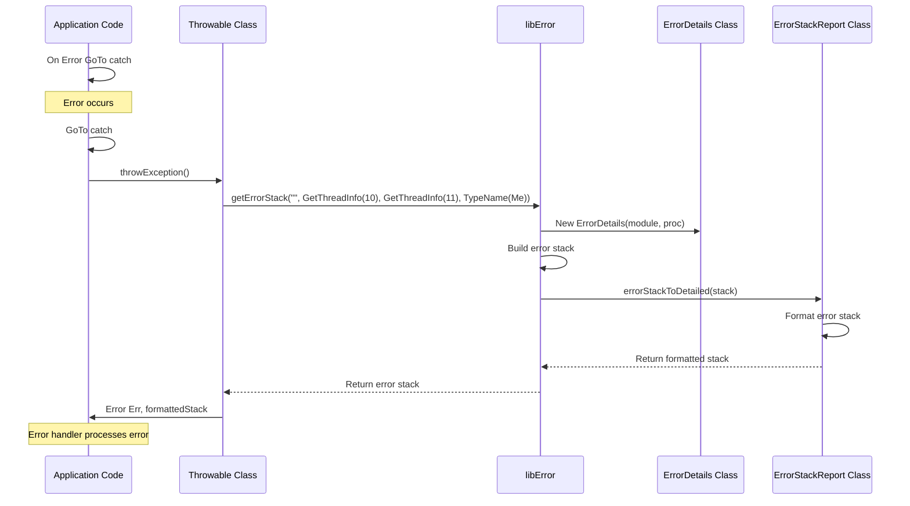

### Detailed Error Handling

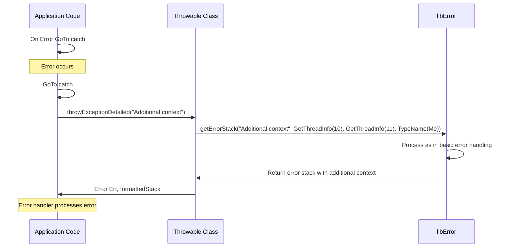

## Logging Sequence

### Direct Logging

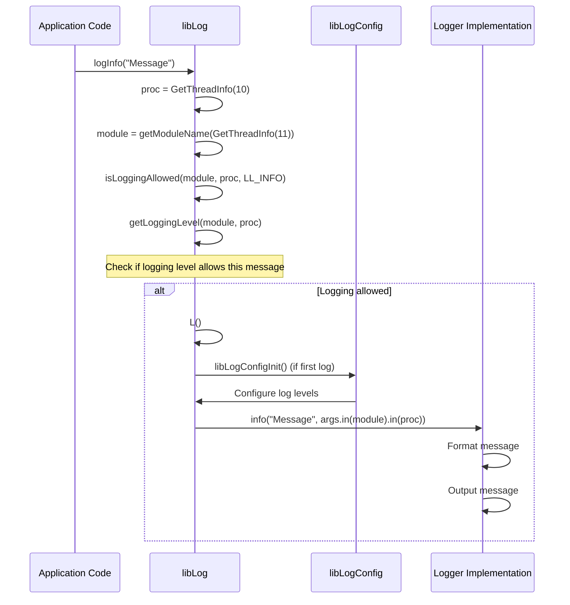

### Class-based Logging

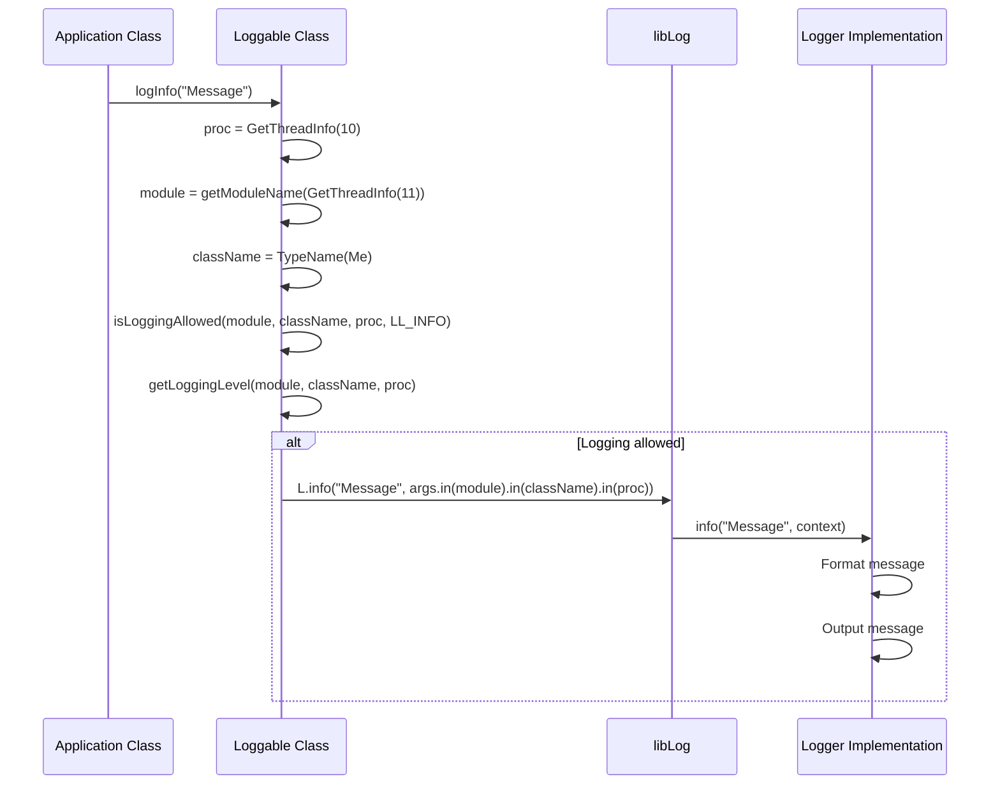

## Tracing Sequence

### Function Entry and Exit

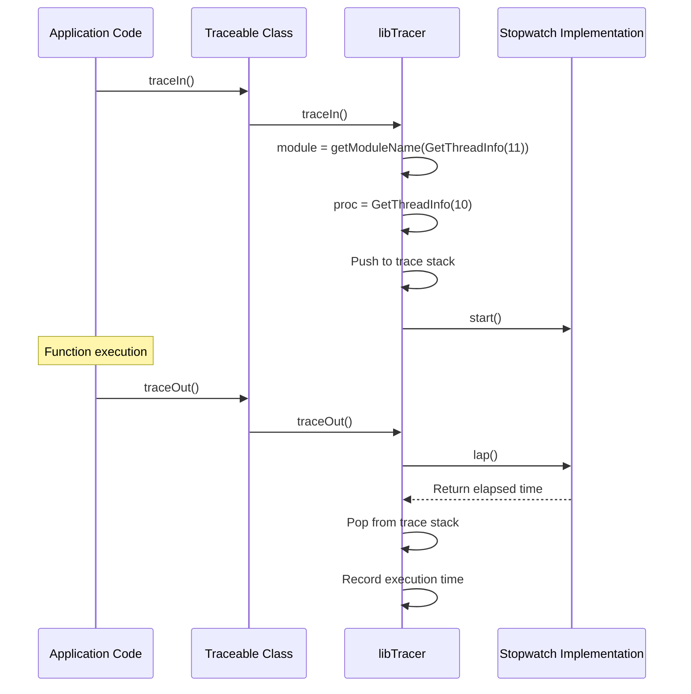

### Trace Reporting

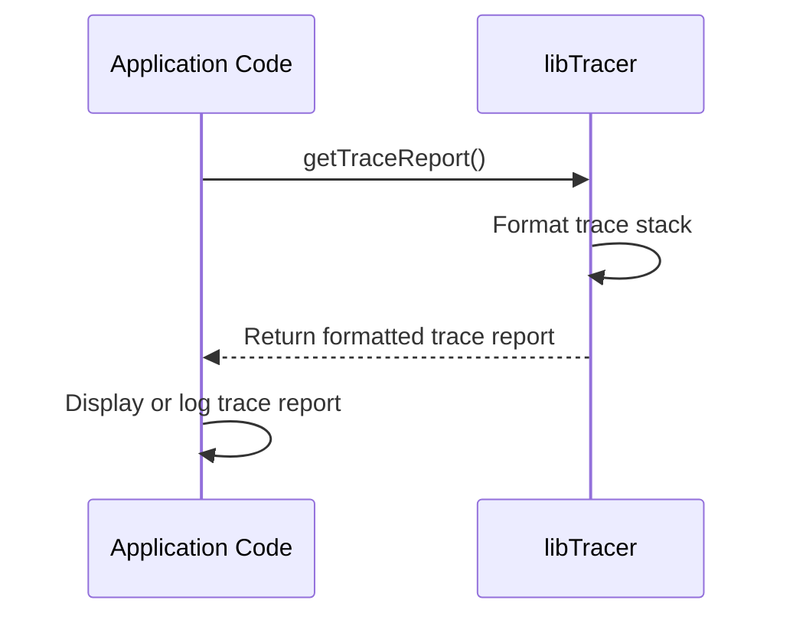

## Unit Testing Sequence

### Test Execution

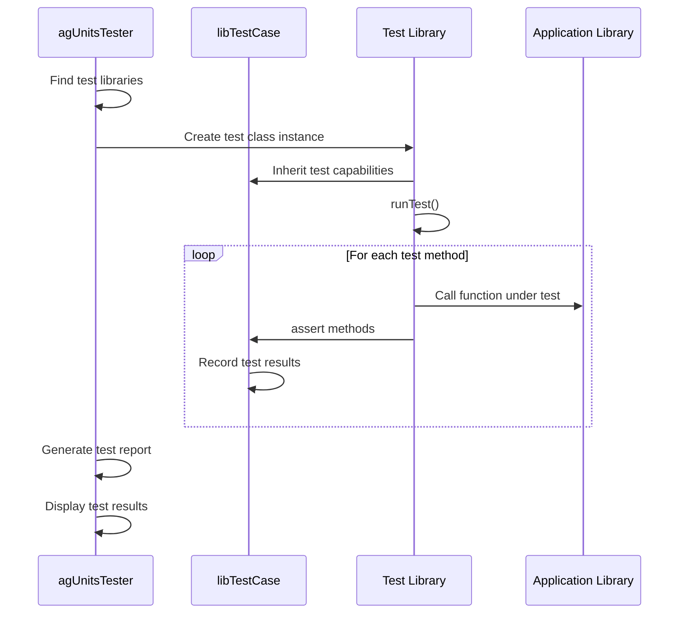

### Assertion Process

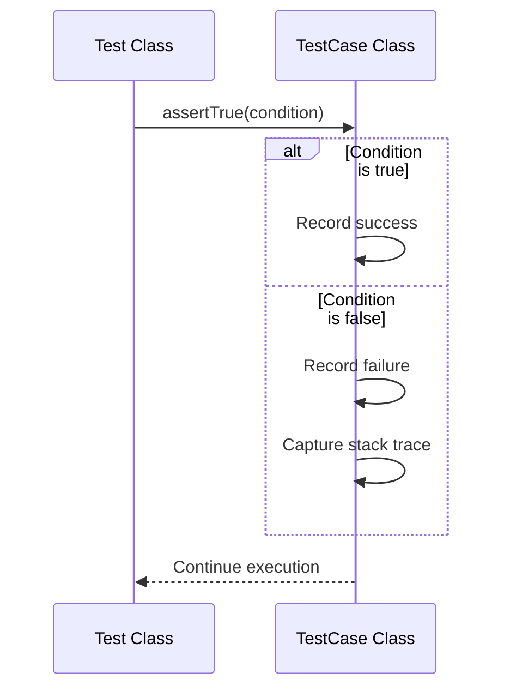

## Complex Scenarios

### Error in Traced Function

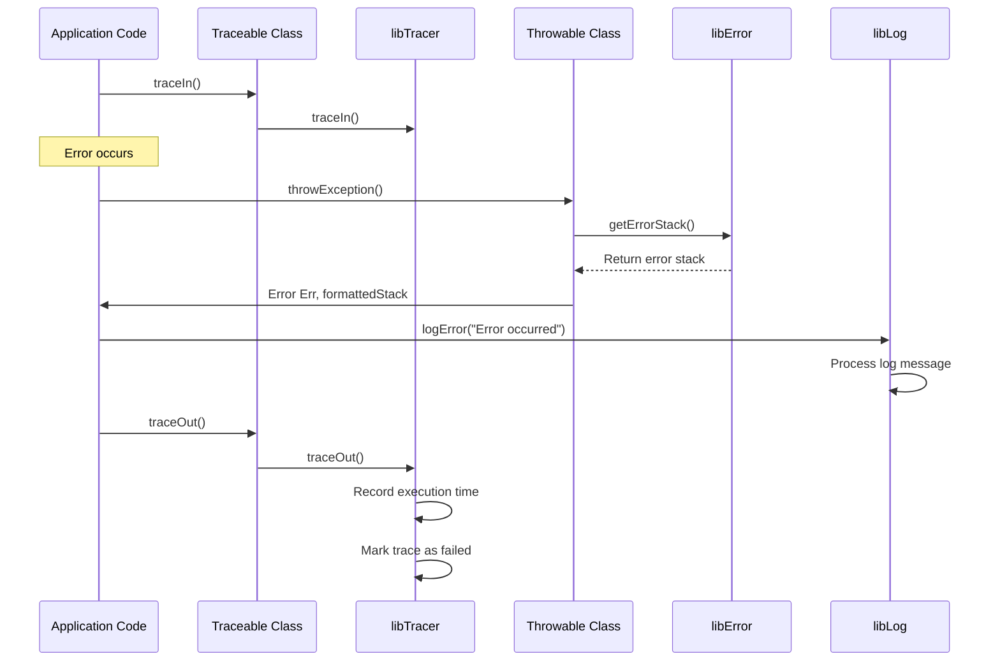

### Logger Configuration and Initialization

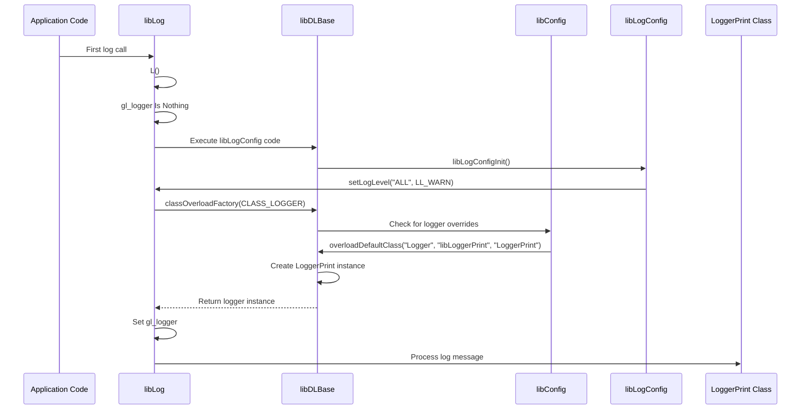

## Component Interaction for Key Operations

### Application Startup

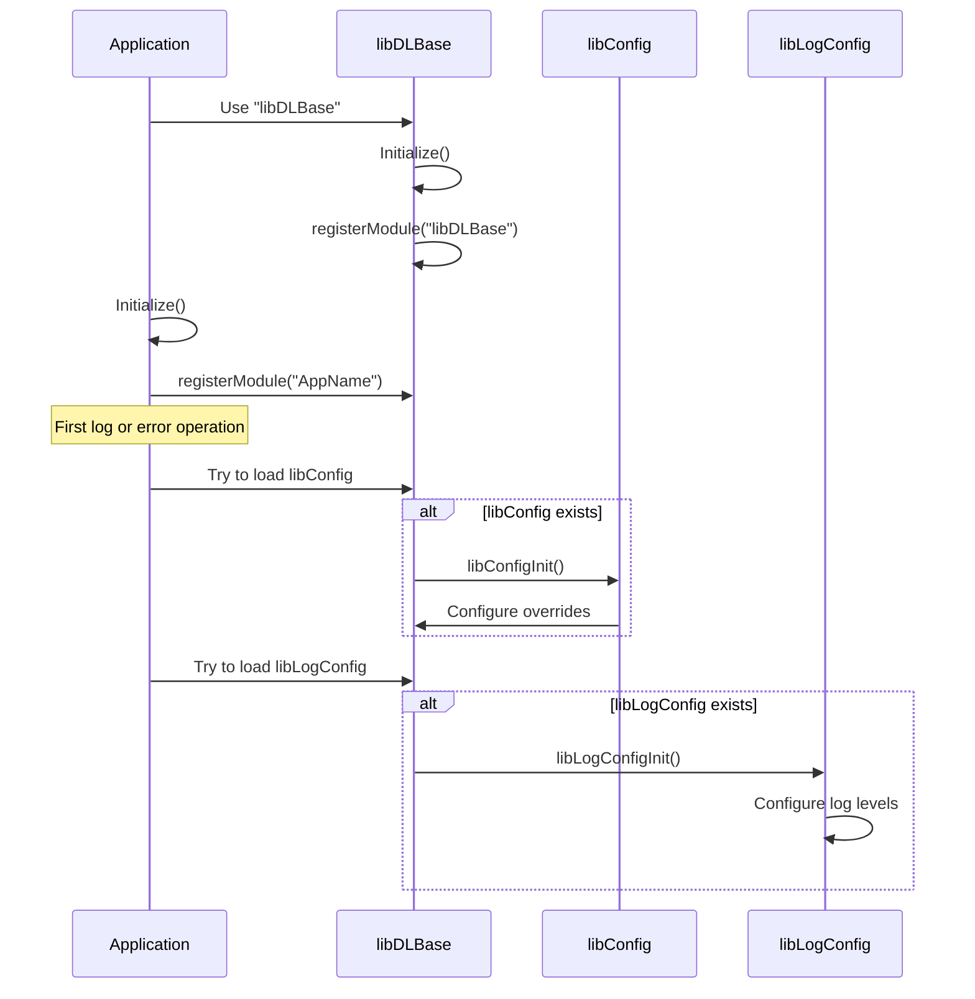

### Error Handling with Logging

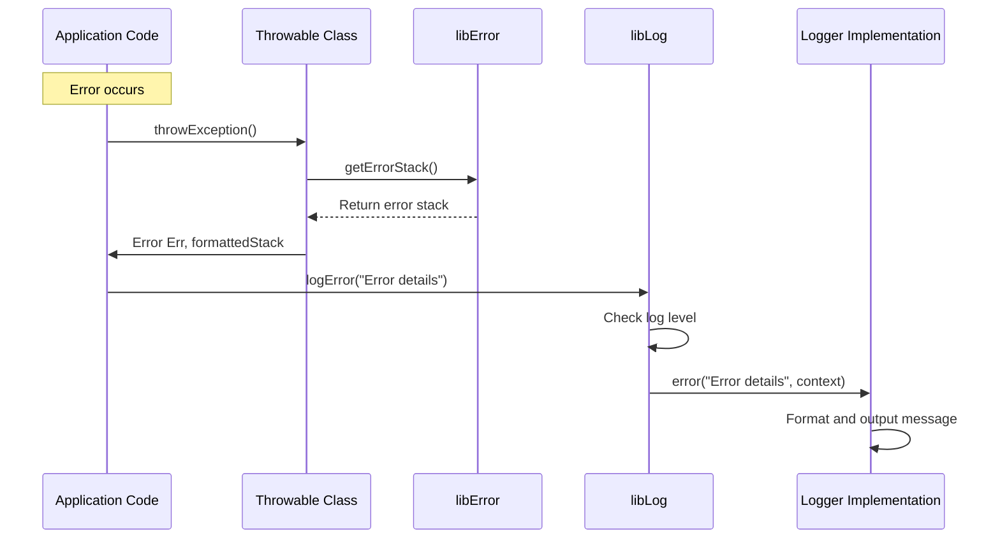

## Best Practices for Component Interaction

1. **Proper Initialization**: Always call `registerModule` in the `Initialize` sub of each module.

2. **Error Handling Pattern**: Use the standard error handling pattern with `On Error GoTo catch` and `throwException`.

3. **Tracing Discipline**: Always pair `traceIn` with `traceOut`, even in error paths.

4. **Log Level Selection**: Choose appropriate log levels for different types of messages.

5. **Class Inheritance**: Use the appropriate base class (`Throwable`, `Loggable`, `Traceable`) based on the functionality needed.

## Implementation Considerations

1. **Thread Safety**: The framework uses thread-specific information to track module names and trace stacks.

2. **Performance Impact**: Tracing and detailed logging can impact performance, especially in tight loops.

3. **Error Recovery**: The framework is designed to continue functioning even if parts of it encounter errors.

4. **Extension Points**: The framework provides several extension points through class inheritance and overrides.