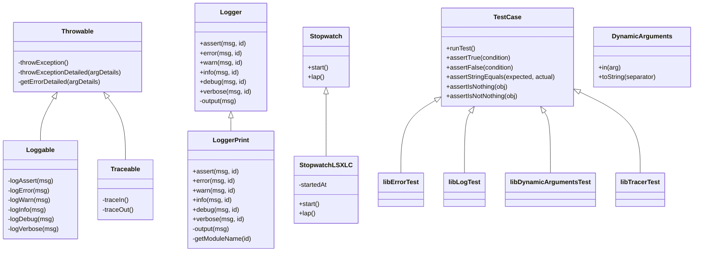
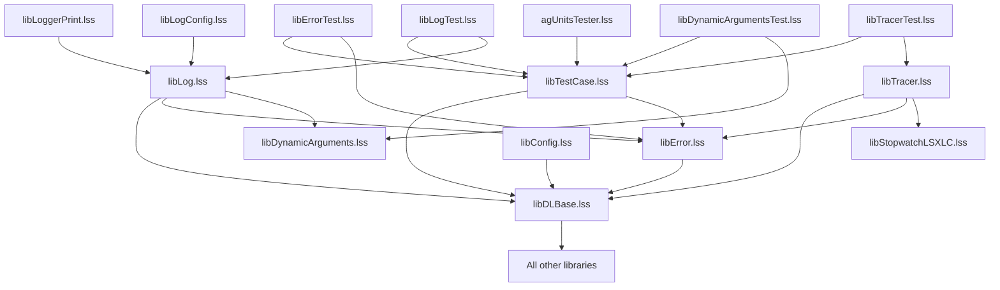

# LotusScript Developer Layer (LSDL) - Source Code Documentation

## Overview

This document provides detailed documentation for each source code file in the LotusScript Developer Layer (LSDL) framework. It explains the purpose, functionality, and key components of each file to aid in understanding the codebase and planning the migration to Angular and Java Spring.

## Source Directory Structure

```
├── extensions/
│   └── libraries/
│       ├── libConfig.lss
│       ├── libLogConfig.lss
│       └── libLoggerPrint.lss
├── source/
│   ├── agents/
│   │   └── agUnitsTester.lss
│   ├── libraries/
│   │   ├── libDLBase.lss
│   │   ├── libDynamicArguments.lss
│   │   ├── libError.lss
│   │   ├── libLog.lss
│   │   ├── libStopwatchLSXLC.lss
│   │   ├── libTestCase.lss
│   │   └── libTracer.lss
│   └── toolbar-action.formula
└── test/
    └── libraries/
        ├── libDynamicArgumentsTest.lss
        ├── libErrorTest.lss
        ├── libLogTest.lss
        └── libTracerTest.lss
```

## Core Libraries

### 1. libDLBase.lss

**Purpose**: Serves as the foundation of the LSDL framework, providing module registration and class factory functionality.

**Key Components**:
- **Module Registration**: `registerModule()` function allows libraries and other design elements to register themselves in the system.
- **Class Factory**: `classInstanceFactory()` and `classOverloadFactory()` functions provide dynamic class instantiation and overloading capabilities.
- **Global Variables**: Maintains lists of modules and class overrides.

**Key Functions**:
- `registerModule(argName)`: Registers a module name for the current thread.
- `getModuleName(argAlias)`: Retrieves the registered name for a module.
- `classInstanceFactory(argLSLibraryName, argClassName)`: Creates an instance of a class from a specified library.
- `classOverloadFactory(argClassName)`: Creates an instance of an overloaded class.
- `overloadDefaultClass(argDefault, argOverloadLib, argOverload)`: Registers a class override.

**Usage Example**:
```lss
Sub Initialize
    registerModule "MyLibrary"
End Sub
```

### 2. libError.lss

**Purpose**: Provides error handling and stack trace functionality.

**Key Components**:
- **Throwable Class**: Base class for error handling capabilities.
- **ErrorDetails Class**: Stores information about an error.
- **ErrorStackReport Class**: Formats error stack traces for display.
- **ErrorStackHelper Class**: Helps build error stacks.

**Key Functions**:
- `throwException()`: Throws an exception with stack trace.
- `throwExceptionDetailed(argDetails)`: Throws an exception with additional details.
- `getErrorDetailed(argDetails)`: Gets formatted error information.
- `getErrorStack(argDetails, argCallingProc, argCallingModule, argClassName)`: Builds an error stack.

**Usage Example**:
```lss
Sub someFunction()
    On Error GoTo catch
    
    ' Function code
    
    GoTo finally
catch:
    throwException
finally:
End Sub
```

### 3. libLog.lss

**Purpose**: Provides a configurable logging system with multiple log levels.

**Key Components**:
- **Logger Class**: Abstract base class for logger implementations.
- **Loggable Class**: Provides logging capabilities to classes that inherit from it.
- **Log Level Constants**: LL_NONE, LL_ASSERT, LL_ERROR, LL_WARN, LL_INFO, LL_DEBUG, LL_VERBOSE, LL_ALL.

**Key Functions**:
- `logAssert/logError/logWarn/logInfo/logDebug/logVerbose`: Functions for logging at different levels.
- `setLogLevel(module, level)`: Sets the logging level for a module.
- `isLoggingAllowed(module, proc, lLevel)`: Checks if logging is enabled for a specific level.
- `getLoggingLevel(module, proc)`: Gets the configured log level.

**Usage Example**:
```lss
logInfo "Operation started"
' Operation code
logDebug "Operation details: " & details
```

### 4. libTracer.lss

**Purpose**: Provides function tracing and performance measurement capabilities.

**Key Components**:
- **Traceable Class**: Provides tracing capabilities to classes that inherit from it.
- **Stopwatch Interface**: Interface for timing operations.
- **TraceStackItem Class**: Stores information about a traced function call.

**Key Functions**:
- `traceIn()`: Marks function entry.
- `traceOut()`: Marks function exit.
- `getTraceReport()`: Gets a formatted trace report.
- `getTraceStack()`: Gets the current trace stack.

**Usage Example**:
```lss
Sub someFunction()
    traceIn
    On Error GoTo catch
    
    ' Function code
    
    GoTo finally
catch:
    traceOut
    throwException
finally:
    traceOut
End Sub
```

### 5. libDynamicArguments.lss

**Purpose**: Provides a fluent interface for building argument chains.

**Key Components**:
- **DynamicArguments Class**: Implements the fluent interface for arguments.

**Key Functions**:
- `in(arg)`: Adds an argument to the chain.
- `toString(separator)`: Converts arguments to string.

**Usage Example**:
```lss
Dim args As New DynamicArguments()
Call args.in("module").in("class").in("procedure")
```

### 6. libStopwatchLSXLC.lss

**Purpose**: Provides a Stopwatch implementation using the LSXLC extension.

**Key Components**:
- **StopwatchLSXLC Class**: Implements the Stopwatch interface using LSXLC.

**Key Functions**:
- `start()`: Starts timing.
- `lap()`: Returns elapsed time.

**Usage Example**:
```lss
Dim sw As New StopwatchLSXLC()
Call sw.start()
' Code to time
Dim elapsed As Long
elapsed = sw.lap()
```

### 7. libTestCase.lss

**Purpose**: Provides a framework for unit testing.

**Key Components**:
- **TestCase Class**: Base class for unit tests.
- **Various assertion methods**: For validating test conditions.

**Key Functions**:
- `runTest()`: Abstract method to run tests.
- `assertTrue/assertFalse/assertStringEquals/assertIsNothing/assertIsNotNothing`: Various assertion methods.

**Usage Example**:
```lss
Class MyLibraryTest As TestCase
    Private Function runTest() As Variant
        Call testFeature1()
        Call testFeature2()
    End Function
    
    Private Sub testFeature1()
        Call assertTrue(SomeFunction())
    End Sub
End Class
```

## Extension Libraries

### 1. libConfig.lss

**Purpose**: Provides configuration for the LSDL framework.

**Key Components**:
- **libConfigInit()**: Initializes configuration settings.

**Key Functions**:
- `libConfigInit()`: Sets up class overrides and other configuration.

**Usage Example**:
```lss
Call overloadDefaultClass("Logger", "libLoggerPrint", "LoggerPrint")
```

### 2. libLogConfig.lss

**Purpose**: Provides logging-specific configuration.

**Key Components**:
- **libLogConfigInit()**: Initializes logging configuration.

**Key Functions**:
- `libLogConfigInit()`: Sets up log levels for different modules.

**Usage Example**:
```lss
Call setLogLevel("ALL", LL_WARN)
Call setLogLevel("libTracer", LL_DEBUG)
```

### 3. libLoggerPrint.lss

**Purpose**: Provides a Logger implementation that outputs to the status bar.

**Key Components**:
- **LoggerPrint Class**: Implements the Logger interface for status bar output.

**Key Functions**:
- `assert/error/warn/info/debug/verbose`: Implementations of log level methods.
- `output(msg)`: Outputs to status bar/console.
- `getModuleName(id)`: Formats module name for output.

**Usage Example**:
```lss
' This happens automatically when LoggerPrint is configured as the Logger implementation
logInfo "This will be output to the status bar"
```

## Agents

### 1. agUnitsTester.lss

**Purpose**: Provides an agent for running unit tests.

**Key Components**:
- **Test discovery and execution**: Finds and runs test libraries.
- **XML report generation**: Generates test reports in XML format.
- **XSL transformation**: Transforms XML reports to HTML for display.

**Key Functions**:
- Discovers test libraries.
- Creates instances of test classes.
- Runs tests and collects results.
- Generates and displays test reports.

**Usage Example**:
```lss
' Create a button with this formula:
' @Command([RunAgent]; "agUnitsTester" )
```

## Test Libraries

### 1. libErrorTest.lss

**Purpose**: Provides unit tests for the libError library.

**Key Components**:
- **libErrorTest Class**: Test class for libError.
- **ErrorStackReportTestHtml Class**: Custom error report formatter for testing.

**Key Functions**:
- `testError()`: Tests error handling functionality.
- `testModuleName()`: Tests module name registration and retrieval.

### 2. libLogTest.lss

**Purpose**: Provides unit tests for the libLog library.

**Key Components**:
- **libLogTest Class**: Test class for libLog.
- **LoggerTest Class**: Mock logger for testing.

**Key Functions**:
- `testAssert()`: Tests assert logging.
- `testLogLevels()`: Tests different log levels.

### 3. libDynamicArgumentsTest.lss

**Purpose**: Provides unit tests for the libDynamicArguments library.

**Key Components**:
- **libDynamicArgumentsTest Class**: Test class for libDynamicArguments.

**Key Functions**:
- Tests for the DynamicArguments class functionality.

### 4. libTracerTest.lss

**Purpose**: Provides unit tests for the libTracer library.

**Key Components**:
- **libTracerTest Class**: Test class for libTracer.

**Key Functions**:
- Tests for the tracing functionality.

## Other Files

### 1. toolbar-action.formula

**Purpose**: Provides a formula for a toolbar button to run the unit tester agent.

**Content**:
```
@Command([RunAgent]; "agUnitsTester")
```

## Class Relationships



## File Dependencies



## Key Concepts and Patterns

### 1. Module Registration

Every library registers itself in the `Initialize` sub:

```lss
Sub Initialize
    registerModule "libName"
End Sub
```

This allows the framework to properly identify modules in logs, traces, and error reports.

### 2. Error Handling Pattern

Standard error handling pattern used throughout the codebase:

```lss
Sub someFunction()
    On Error GoTo catch
    
    ' Function code
    
    GoTo finally
catch:
    throwException
finally:
End Sub
```

### 3. Tracing Pattern

Standard tracing pattern used throughout the codebase:

```lss
Sub someFunction()
    traceIn
    On Error GoTo catch
    
    ' Function code
    
    GoTo finally
catch:
    traceOut
    throwException
finally:
    traceOut
End Sub
```

### 4. Class Inheritance Pattern

Classes can inherit from base classes to gain functionality:

```lss
Class MyClass As Throwable
    ' Inherits error handling capabilities
End Class

Class MyLoggableClass As Loggable
    ' Inherits both error handling and logging capabilities
End Class

Class MyTraceableClass As Traceable
    ' Inherits error handling and tracing capabilities
End Class
```

### 5. Extension Pattern

The framework can be extended through class overrides:

```lss
Call overloadDefaultClass("Logger", "myLibrary", "MyLogger")
```

This allows for customization without modifying the core code.

## Conclusion

The LSDL framework provides a comprehensive set of tools for error handling, logging, tracing, and unit testing in LotusScript. Understanding the structure and functionality of each source file is essential for planning the migration to Angular and Java Spring.

The framework follows consistent patterns and practices, which can be mapped to equivalent patterns in modern frameworks. The modular design and clear separation of concerns will facilitate the migration process.